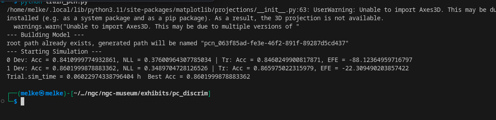

# Sentiment Analysis using Predictive Coding Network (PCN)

This project performs sentiment analysis on IMDB movie reviews using a Predictive Coding Network (PCN) model. The goal is to classify each review as either positive or negative by training the model on labeled data. This approach involves converting the text data into a numerical format and feeding it into a PCN model optimized to distinguish between the two classes.



---

## Project Structure

- **IMDB.csv**: Dataset containing movie reviews and sentiment labels (positive/negative).
- **pcn_model.py**: Contains the PCN model implementation, which is modified to include an additional hidden layer.
- **train_pcn.py**: The main script for loading data, preprocessing, training, and evaluating the model.

## Setup and Requirements

- Python 3.x
- Required libraries: `pandas`, `numpy`, `jax`, `scikit-learn`

To install the necessary libraries, run:
```bash
pip install -r requirements.txt
